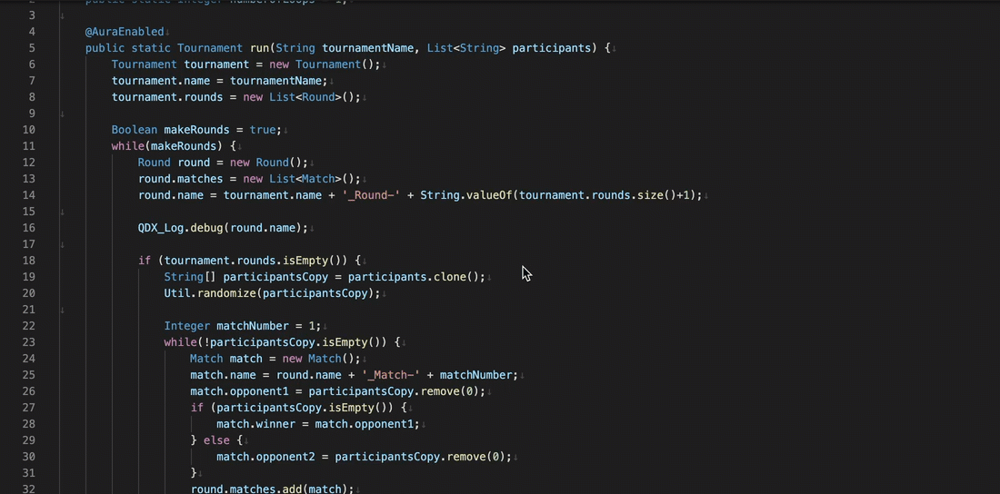

# QDX Utils

<a href="https://githubsfdeploy.herokuapp.com">
  
</a>

These are some utilities for use in salesforce projects.

## Salesforce Logging Utility

This utility is based on salesforce platform events for providing an efficient alternative to traditional System.debug logging. You can configure this utility to get log events for a specific class and method. You can also filter the log results for a specific user as needed.

### How to Configure

Configuration is simple. Just add the __qdxLogMonitor__ lightning web component to any lightning app page where you would like to see the log events.


To get log events for a class, start by setting up "Log Setting" custom metadata type records. Set the MasterLabel of record  same as the class API name. This is case sensitive so make sure it matches exactly with the class API name. Set the aggregate checkbox to true if you want to control when the events are fired. If set to false, you will see events as the code is executed even if the transaction fails or rolls back.


Within your classes, you can replace any System.debug statements with __QDX_Log.debug__ method. If you need to persist error in database, you can call the __QDX_Log.error__ method. For this to work, you will also need to configure a metadata type record where QDX_ErrorClassName is set to the class API name where __QDX_Log.IError__ interface is implemented.

- There is no instantiation of anything required. Simply use __QDX_Log.debug__ same as you would have done with __System.debug__.
- Remember that you will only see events at or below logging level setting. Log Setting custom setting records needs to be defined to use the framework.

```java
//Before
Account acc = [SELECT Id, Name FROM Account WHERE Id = '0010006354Tyyhe'];
System.debug('----> Account record: ' + acc);

//After
Account acc = [SELECT Id, Name FROM Account WHERE Id = '0010006354Tyyhe'];
QDX_Log.debug('Account record: ' + acc);

// You can also pass a list of sObjects (or any other type) to be logged
QDX_Log.debug(accountList);
QDX_Log.debug(contactList);

//We can also pass a format string and values
QDX_Log.debug('Viewing {0} account with {1} contacts', new List<Object>{acc.Name, contactList.size()};

```



### Additional Info

- This utility exposes following methods;
  - QDX_Log.fine
  - QDX_Log.info
  - QDX_Log.debug
  - QDX_Log.error
  - QDX_Log.limits
  - QDX_Log.publish
- The limits and publish methods does not take any parameters.
- The debug/error methods can take following parameters;
  - First parameter can be a string, an object or list of objects
  - Optionally you can pass an id as the second parameter. By default, the utility will group events by the event timestamp. If an Id parameter is passed then that is used for grouping.


This utility is inspired by [this](https://github.com/rsoesemann/apex-unified-logging).

Enjoy!
